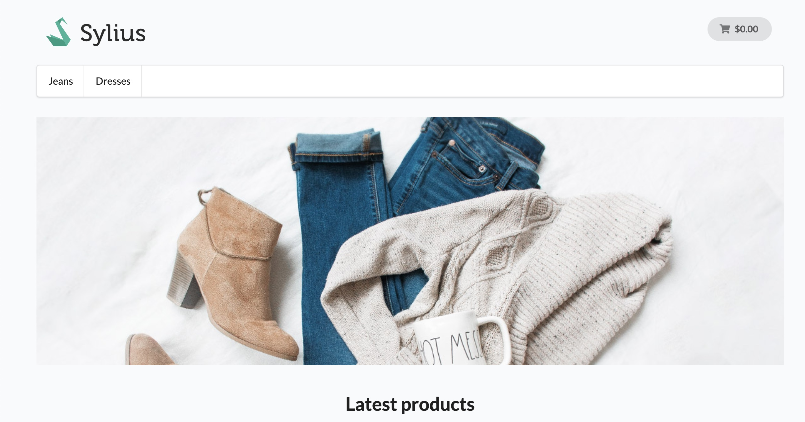

<p align="center">
    <a href="https://monsieurbiz.com" target="_blank">
        
    </a>
    &nbsp;&nbsp;&nbsp;&nbsp;
    <a href="https://monsieurbiz.com/agence-web-experte-sylius" target="_blank">
        
    </a>
    <br/>
    
</p>

<h1 align="center">Menu Plugin</h1>

[](https://github.com/monsieurbiz/SyliusAntiSpamPlugin/blob/master/LICENSE.txt)
[](https://github.com/monsieurbiz/SyliusAntiSpamPlugin/actions?query=workflow%3ATests)
[](https://github.com/monsieurbiz/SyliusAntiSpamPlugin/actions?query=workflow%3ASecurity)

This plugins allows you to customize your menu

## Installation

```bash
composer require monsieurbiz/sylius-menu-plugin
```

Change your `config/bundles.php` file to add the line for the plugin :

```php
<?php

return [
    //..
    MonsieurBiz\SyliusMenuPlugin\MonsieurBizSyliusMenuPlugin::class => ['all' => true],
];
```

Then create the config file in `config/packages/monsieurbiz_sylius_menu_plugin.yaml` :

```yaml
imports:
    - { resource: "@MonsieurBizSyliusMenuPlugin/Resources/config/config.yaml" }
```
Finally import the routes in `config/routes/monsieurbiz_plugin_menu.yaml` :

```yaml
monsieurbiz_menu_admin:
    resource: "@MonsieurBizSyliusMenuPlugin/Resources/config/routes/admin.yaml"
    prefix: /%sylius_admin.path_name%
```

### Migrations

Make a doctrine migration diff :

```php
bin/console doctrine:migrations:diff
```

Then run it :

```php
bin/console doctrine:migrations:migrate
```
## Customize your menu
If you want to customize your menu, do so by overriding the menuItem entity (more info about overriding entities [here](https://docs.sylius.com/en/1.9/customization/model.html) )

## Menu example

### Admin form index


### Menu front view



## Contributing

You can open an issue or a Pull Request if you want! 😘  
Thank you!
