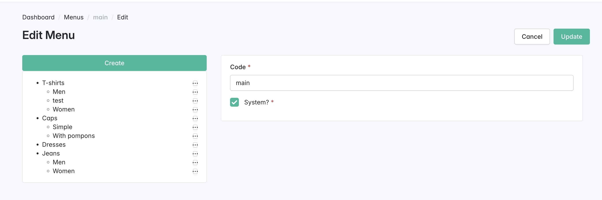

[](https://monsieurbiz.com/agence-web-experte-sylius)

<h1 align="center">Sylius Menu Plugin</h1>

[](https://github.com/monsieurbiz/SyliusMenuPlugin/blob/master/LICENSE.txt)
[](https://github.com/monsieurbiz/SyliusMenuPlugin/actions?query=workflow%3ATests)
[](https://github.com/monsieurbiz/SyliusMenuPlugin/actions?query=workflow%3ASecurity)
[](https://github.com/monsieurbiz/SyliusMenuPlugin/actions?query=workflow%3ASecurity)

This plugins allows you to manage your menus.

## Compatibility

| Sylius Version | PHP Version |
|----------------|-------------|
| 2.0            | 8.2 - 8.3   |

ℹ️ For Sylius 1.x, see our [1.x branch](https://github.com/monsieurbiz/SyliusMenuPlugin/tree/1.x) and all 1.x releases.

## Installation

If you want to use our recipes, you can configure your composer.json by running:

```bash
composer config --no-plugins --json extra.symfony.endpoint '["https://api.github.com/repos/monsieurbiz/symfony-recipes/contents/index.json?ref=flex/master","flex://defaults"]'
```

```bash
composer require monsieurbiz/sylius-menu-plugin
```

Change your `config/bundles.php` file to add the line for the plugin:

```php
<?php

return [
    //..
    MonsieurBiz\SyliusMenuPlugin\MonsieurBizSyliusMenuPlugin::class => ['all' => true],
];
```

Then create the config file in `config/packages/monsieurbiz_sylius_menu_plugin.yaml`:

```yaml
imports:
    - { resource: "@MonsieurBizSyliusMenuPlugin/Resources/config/config.yaml" }

twig:
    form_themes: ['@MonsieurBizSyliusMenuPlugin/admin/browser/form/theme.html.twig']
```
Finally import the routes in `config/routes/monsieurbiz_sylius_menu_plugin.yaml`:

```yaml
monsieurbiz_menu_admin:
    resource: "@MonsieurBizSyliusMenuPlugin/Resources/config/routes/admin.yaml"
    prefix: /%sylius_admin.path_name%
```

Then run it:

```php
bin/console doctrine:migrations:migrate
```

## Customize your menu

If you want to customize your menu, like adding an image, do so by overriding the MenuItem entity (more info about [overriding entities in the Sylius documentation](https://docs.sylius.com/the-customization-guide/customizing-models)).

## Add URL Provider

The URLs selector allows you to select a URL from a list of URLs.
It provides URLs for:
- Taxons
- Products

You can add your own custom Provider by creating a class which implements the `MonsieurBiz\SyliusMenuPlugin\Provider\UrlProviderInterface` interface.

## Menu example

### Admin form index



### Menu front view

The front view is exactly the same as the default one.

## Customize front view

**Simple example**

A menu can look very differently depending on where it should be displayed so most of the time you will need to create your own template to display it.

A good starting point is to create a `monsieur_biz:shared:menu` component associated with your display template. You can find examples in the configuration file [twig_hooks.yaml of the plugin](src/Resources/config/sylius/twig_hooks.yaml).

To get the first items of a menu, you can call the `getMenuItems` method of the component:

```twig

```

Replace `menu_code` with the code of the menu you want to display.  
Then you can loop through the items and display them as you want.

**Advanced example**

If you wish to define a menu code by channel and/or locale, we recommend you use the [plugin Settings](https://github.com/monsieurbiz/SyliusSettingsPlugin).

In this case, create a menu template containing, for example :

```twig



{# ... #}
```

And use it in a configuration file which must be loaded after the `config/packages/monsieurbiz_sylius_menu_plugin.yaml` file:

```yaml
sylius_twig_hooks:
    hooks:
        'sylius_shop.base.header.navbar':
            menu:
                component: 'monsieur_biz:shared:menu'
                props:
                    template: 'shop/shared/menu.html.twig'
                configuration:
                    alias: 'app.mysetting'
                    path: 'main_menu_code'
                priority: 0
```

## Contributing

You can open an issue or a Pull Request if you want! 😘  
Thank you!
